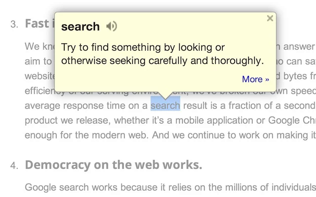
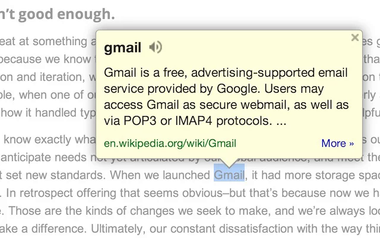
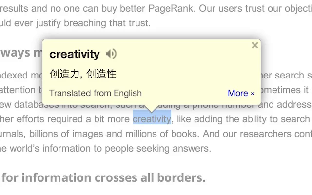
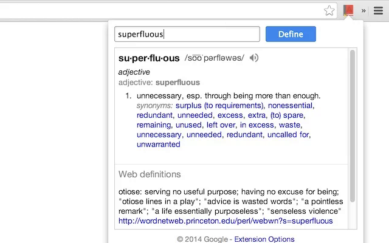
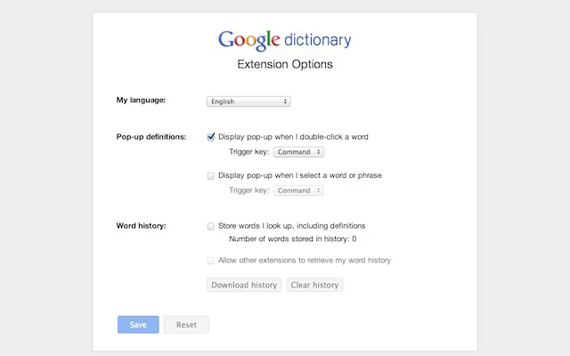

# Google-Dictionary
## Google Dictionary (By Google) - Reversed Engineered For Education Purposes

View definitions easily as you browse the web.
IMPORTANT:
 - The pop-up bubble will not work in tabs that were open prior to installation. After installing this extension, either reload your open tabs or restart Chrome.
 - Note that all extensions are disabled on Chrome Web Store pages (including this one). Do not test the extension on this page; it will not work!
 - If the extension is not working for you, please make sure it's up to date. Visit chrome://extensions/, click the "Update extensions now" button, then restart Chrome.

----------

With this extension, you can:
1) Double-click any word to view its definition in a small pop-up bubble.
2) View the complete definition of any word or phrase using the toolbar dictionary.
3) Store a history of words you've looked up, so you can practice them later.

Foreign words are automatically translated to your language of choice.

Supported dictionaries:
 - Brazilian Portuguese
 - Chinese (Simplified)
 - Chinese (Traditional)
 - Czech
 - Dutch
 - English
 - French
 - German
 - Italian
 - Japanese
 - Korean
 - Russian
 - Slovak
 - Spanish

If you opt in (via the options page), this extension will store a history of all your looked-up words and their definitions. You can download this history as a CSV file at any time. In addition, you can allow other Chrome extensions to access this history. For example, a third-party extension could produce flashcards to help you practice words you've looked up before.

By installing this extension, you agree to the Terms of Service: http://www.google.com/policies/terms/

